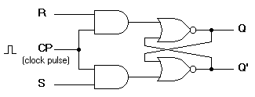
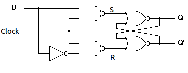
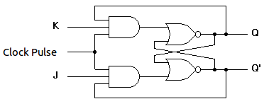
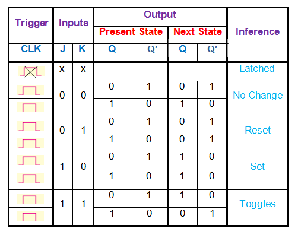
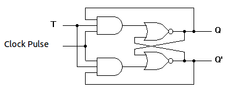
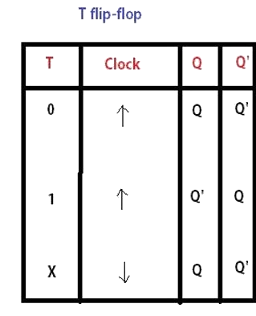

### Introduction

A flip flop is an electronic circuit with two stable states that can be used to store binary data. The stored data can be changed by applying varying inputs. Flip-flops and latches are fundamental building blocks of digital electronics systems used in computers, communications, and many other types of systems.   
1) R-S flip flop 
2) D flip flop 
3) J-K flip flop 
4) T flip flop 

### 1) RS flip flop

The basic NAND gate RS flip flop circuit is used to store the data and thus provides feedback from both of its outputs again back to its inputs. The RS flip flop actually has three inputs, SET, RESET and clock pulse. 

 <b> Figure-1:R-S flip flop circuit diagram</b>  
  <b>Figure-2:Characteristics table of R-S flip flop</b> 

     
### 2) D flip flop

A D flip flop  has a single data input. This type of flip flop is obtained from the SR flip flop by connecting the R input through an inverter, and the S input is connected directly to data input. The modified clocked SR flip-flop is known as D-flip-flop and is shown below. From the truth table of SR flip-flop we see that the output of the SR flip-flop is in unpredictable state when the inputs are same and high. In many practical applications, these input conditions are not required. These input conditions can be avoided by making them complement of each other. 

 <b> Figure-3:Circuit diagram of D flip flop</b>  

  <b>Figure-4:Characteristics table of D flip flop</b> 

### 3) J-K flip flop

In a RS flip-flop the input R=S=1 leads to an indeterminate output. The RS flip-flop circuit may be re-joined if both inputs are 1 than also the outputs are complement of each other as shown in characteristics table below.  

 <b> Figure-5:Circuit diagram of J-K flip flop</b>  
       
  <b>Figure-6:Characteristics table of J-K flip flop</b> 

  
### 4) T flip flop

T flip-flop is known as toggle flip-flop. The T flip-flop is modification of the J-K flip-flop. Both the JK inputs of the JK flip – flop are held at logic 1 and the clock signal continuous to change as shown in table below.  

 <b>Figure-7:Circuit diagram of T flip flop</b>  
  <b> Figure-8:Characteristics table of T flip flop</b> 

      

